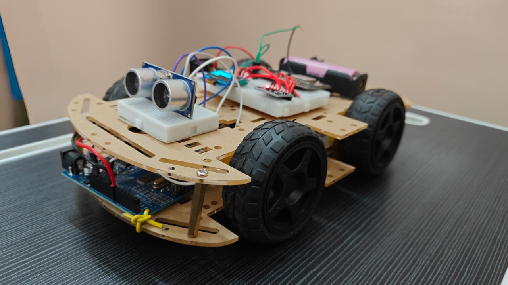
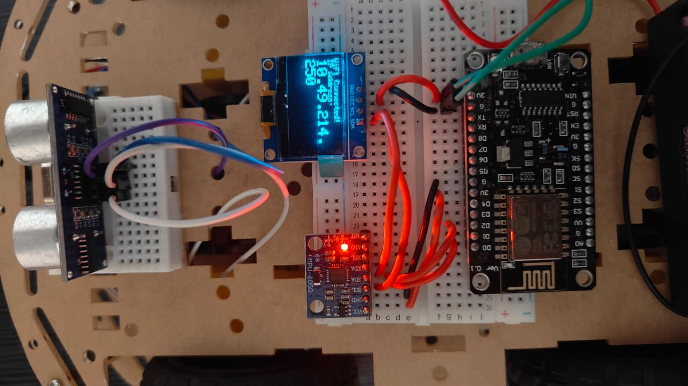
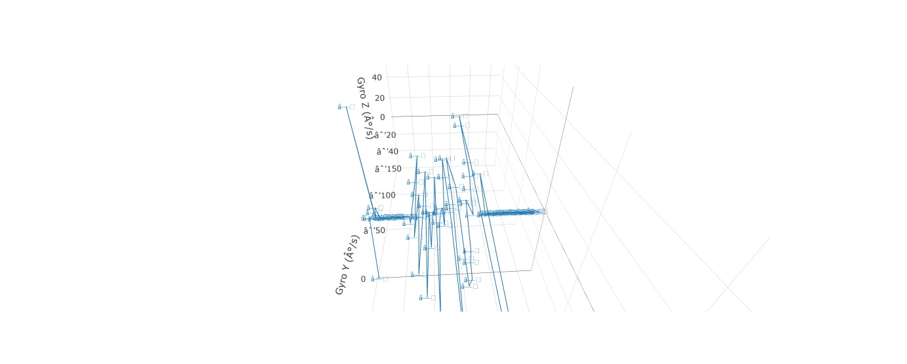

# Automatic Survey Machine

## Project Overview
The **Automatic Survey Machine** is a low-cost autonomous robotic system designed to assist in land surveying applications. The system integrates **obstacle detection**, **motion control**, and **real-time orientation monitoring** using ultrasonic and gyroscope sensors.

The robot autonomously navigates its environment while simultaneously measuring terrain slope and movement, visualizing this data on a live web dashboard.

---

## Objectives
- Design a low-cost autonomous survey robot
- Detect obstacles and avoid collisions automatically
- Measure terrain orientation using a gyroscope
- Visualize motion data in real time on a web interface
- Provide a portable and scalable surveying solution

---

## System Architecture

### Subsystem 1: Obstacle Detection and Motion Control
- Microcontroller: Arduino / ESP32
- Sensor: HC-SR04 Ultrasonic Sensor
- Actuators: DC motors with H-bridge driver
- Function:
  - Distance measurement using ultrasonic echo timing
  - Forward motion if distance > 20 cm
  - Left turn if distance ≤ 20 cm
  - Fully autonomous navigation

---

### Subsystem 2: Gyroscope Data Acquisition and Web Visualization
- Microcontroller: ESP8266
- Sensor: MPU6050 IMU
- Display: OLED (SSD1306)
- Communication:
  - Wi-Fi web server
  - WebSocket-based real-time data streaming
- Visualization:
  - Live 3D plot (Time vs Gyro Y vs Gyro Z) using Plotly

---

## Methodology

### Obstacle Avoidance Logic
1. Trigger ultrasonic sensor
2. Measure echo pulse width
3. Calculate distance
4. Decision logic:
   - Distance > 20 cm → Move forward
   - Distance ≤ 20 cm → Turn left

---

### Gyroscope Data Visualization
1. Read gyroscope Y and Z axis data
2. Transmit data via WebSocket
3. Render live 3D plot in browser
4. Display Wi-Fi IP address on OLED

---

## Hardware Components
- ESP32 / Arduino Uno
- ESP8266 Wi-Fi module
- HC-SR04 Ultrasonic Sensor
- MPU6050 IMU
- DC Motors with Motor Driver
- OLED Display (SSD1306)
- Breadboard and jumper wires

---

## Software and Tools
- Arduino IDE
- ESP8266 Wi-Fi libraries
- WebSockets
- Plotly.js
- Embedded C/C++

---

## Source Code

The project is organized into two independent subsystems, each implemented with a dedicated microcontroller and source code.

### 1. Obstacle Detection and Motion Control
This module controls the autonomous movement of the robot using an ultrasonic sensor and DC motors. It continuously measures the distance to obstacles and applies decision logic to navigate safely.

- Path: `https://github.com/milanbhat1/automatic-survey-machine/obstacle_avoidance/obstacle_avoidance_robot.ino`
- Key features:
  - Ultrasonic distance measurement (HC-SR04)
  - PWM-based DC motor control
  - Autonomous obstacle avoidance logic

---

### 2. Gyroscope Data Acquisition and Web Visualization
This module acquires real-time gyroscope data and streams it wirelessly to a browser-based dashboard for live visualization.

- Path: `https://github.com/milanbhat1/automatic-survey-machine/gyro_web_visualization/esp8266_gyro_websocket.ino`
- Key features:
  - MPU6050 gyroscope data acquisition
  - Wi-Fi–based web server and WebSocket communication
  - Real-time 3D visualization using Plotly
  - OLED display for IP address and status

---

Each source file is fully commented and can be compiled and uploaded independently using the Arduino IDE.

---

## Hardware Setup

---

## Web-Based Visualization

---

## Results and Observations
- Successful autonomous navigation
- Reliable obstacle avoidance
- Real-time gyroscope data visualization
- Stable wireless communication
- Low-cost and portable implementation

---

## Limitations
- Basic obstacle avoidance logic
- No GPS-based localization
- Limited to short-range surveying
- Accuracy depends on sensor calibration

---

## Future Enhancements
- GPS integration for position mapping
- ROS 2 based processing
- LiDAR for advanced terrain mapping
- Data logging and export
- 3D surface reconstruction

---

## Contributors
- Adithya Y (4NI23EC005)
- Pranav (4NI24EC407)
- Milan Bhat (4NI23EC019)
- Anirudha (4NI23EC014)

---

## Mentor
Prof. Puneeth C  
Department of Electronics and Communication Engineering
